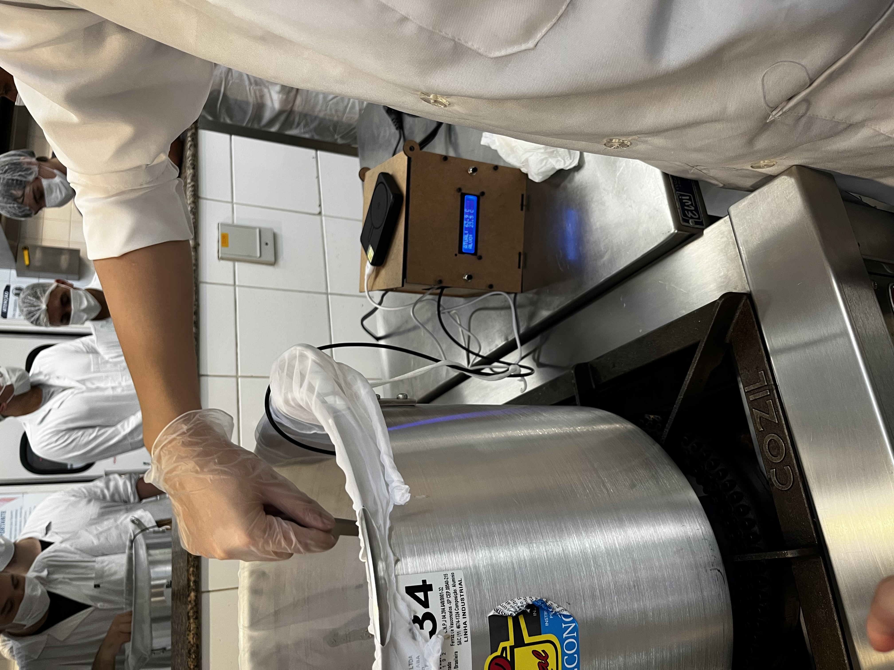
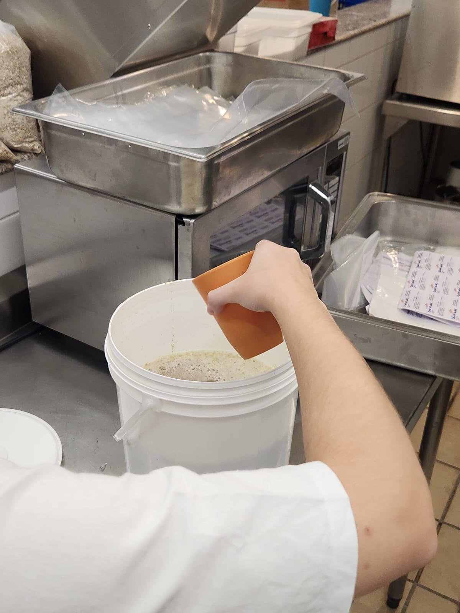
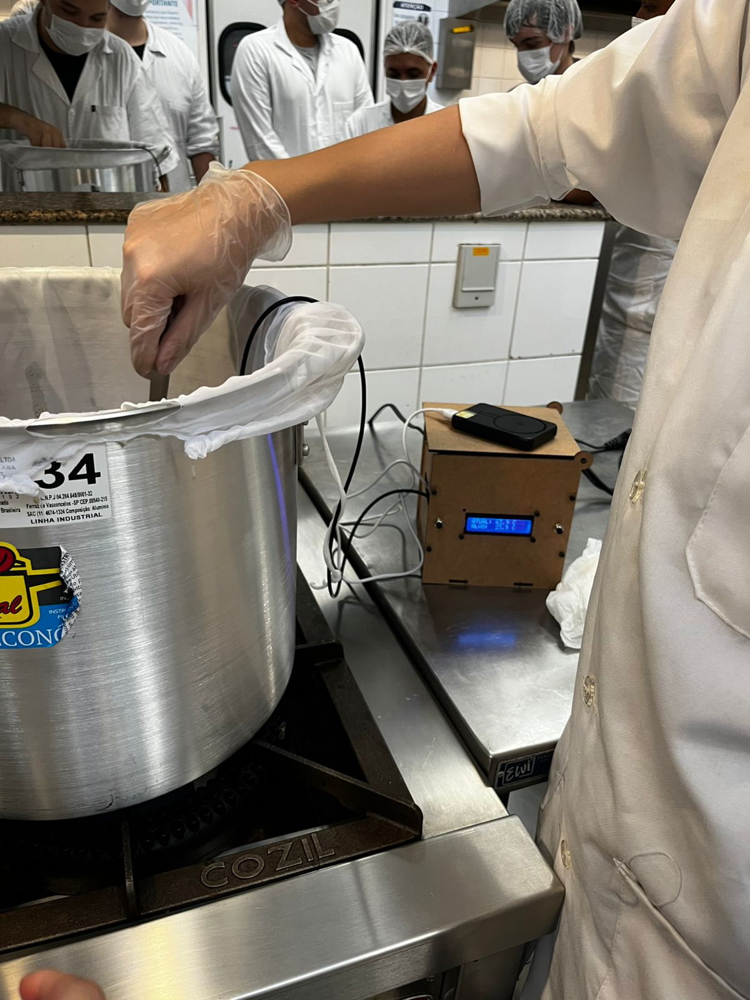
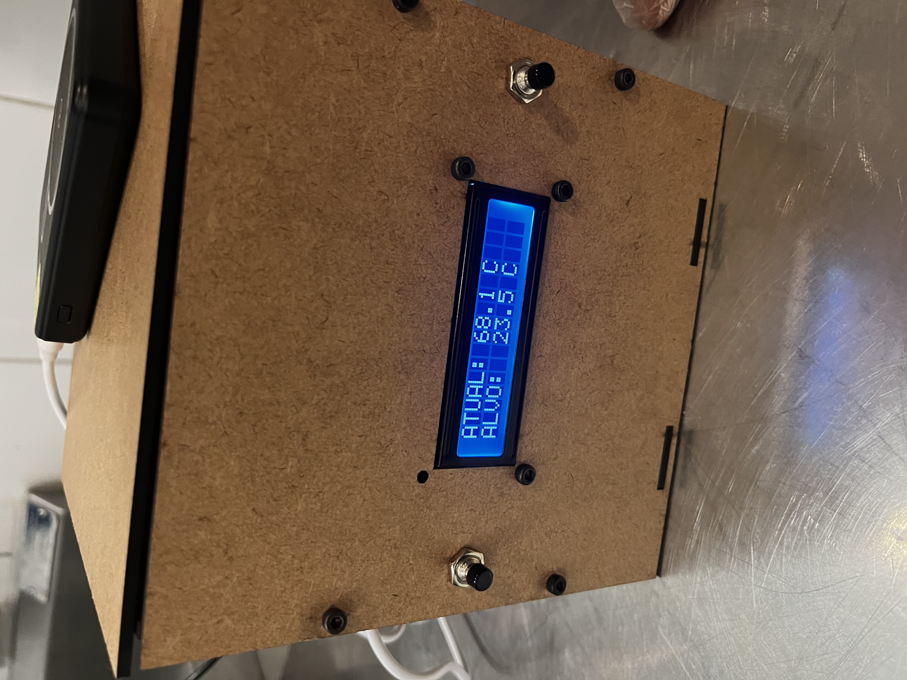
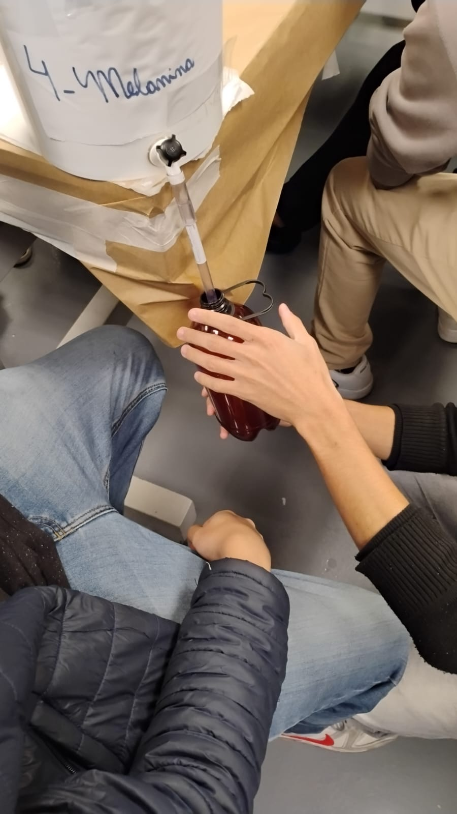
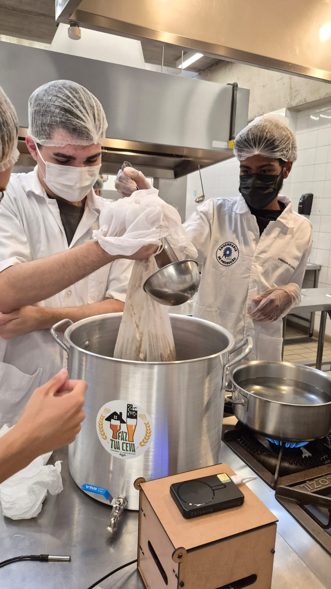

<!-- SEÇÃO 3: GALERIA DE FOTOS DO PROCESSO -->
        <section>
            <h2>Galeria de Produção</h2>
            
Acompanhe abaixo as etapas do desenvolvimento prático do lote e controle do processo:

            
            

                <!-- Foto 1: Extrato -->
                

                    
                    
1. Preparação do Extrato

                

                <!-- Foto 2: Produção (Ajustado se você tirar o acento do arquivo) -->
                

                    
                    
2. Linha de Produção

                

                <!-- Foto 3: Controle de Temperatura (.jpeg) -->
                

                    
                    
3. Monitoramento Térmico

                

                <!-- Foto 4: Fermentação -->
                

                    
                    
4. Processo de Fermentação

                

                <!-- Foto 5: Uso do Controlador -->
                

                    
                    
5. Painel de Controle e Sensores

                

                <!-- Foto 6: Teste de Código -->
                

                    
                    
6. Programação e Teste do Código

                

                <!-- Foto 7: Imagem do Celular -->
                

                    
                    
7. Integração dos Sistemas

                

                <!-- Foto 8: Envase -->
                

                    
                    
8. Envase do Lote

                

                <!-- Foto 9: Enxágue -->
                

                    
                    
9. Higienização e Enxágue

                

            

        </section>
